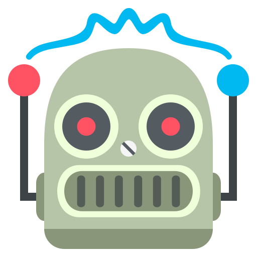

# Arachne Bot Framework

> Mutliplatform Bot Framework

## Documentation
> See [https://github.com/InTechSA/arachne-bot-framework](https://github.com/InTechSA/arachne-bot-framework) to get the documentation.
> [Get Started](https://intechsa.github.io/arachne-bot-framework/brain/start.html).

---

## IMPORTANT
### Known issues
> Hubot-RocketChat v2.x.x will crash due to incompatibilities yet with hubot 3 (atm).